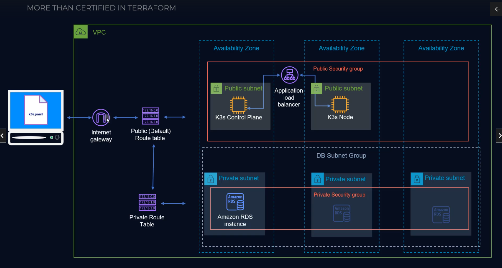

# terraform-aws
This was from the course 'More than Certified in Terraform' by Derek Moran.  Most of this code is following what was written in his course. Some of the files might not be included due to sensitive information.

This was created while following videos in 'Section 4: Deploy AWS Resources with Terraform'.

## Lesson highlights
* Configuring providers
* Deploying a VPC
* refactoring code to not be "Hardcoded"
* VPC Security groups
* Setting up RDS
* ALB Security groups & Listener
* Lifecycle policies
* Deploying EC2 instances
* Deploying NGINX with kubernetes

# Endstate Logical Map

# Source Course
More Than Certified - Derek Morgan\
https://courses.morethancertified.com/p/mtc-terraform
